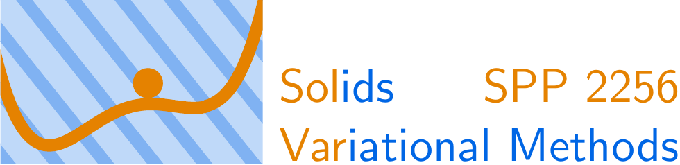

# SVPC
Signed singular value based polyconvexification of isotropic functions

MATLAB implementation of the polyconvexification algorithms presented in [T. Neumeier, M. A. Peter, D. Peterseim, D. Wiedemann. Computational polyconvexification of isotropic functions, arXiv:2307.15676, 2023](https://arxiv.org/abs/2307.15676).

If you use this code, please cite the paper.

## Acknowledgement
The authors gratefully acknowledge funding from the German Research Foundation (DFG) within the [Priority Programme 2256](https://spp2256.ur.de) *Variational Methods for Predicting Complex Phenomena in Engineering Structures and Materials*, project ID 441154176, reference IDs PE1464/7-1 and PE2143/5-1.

